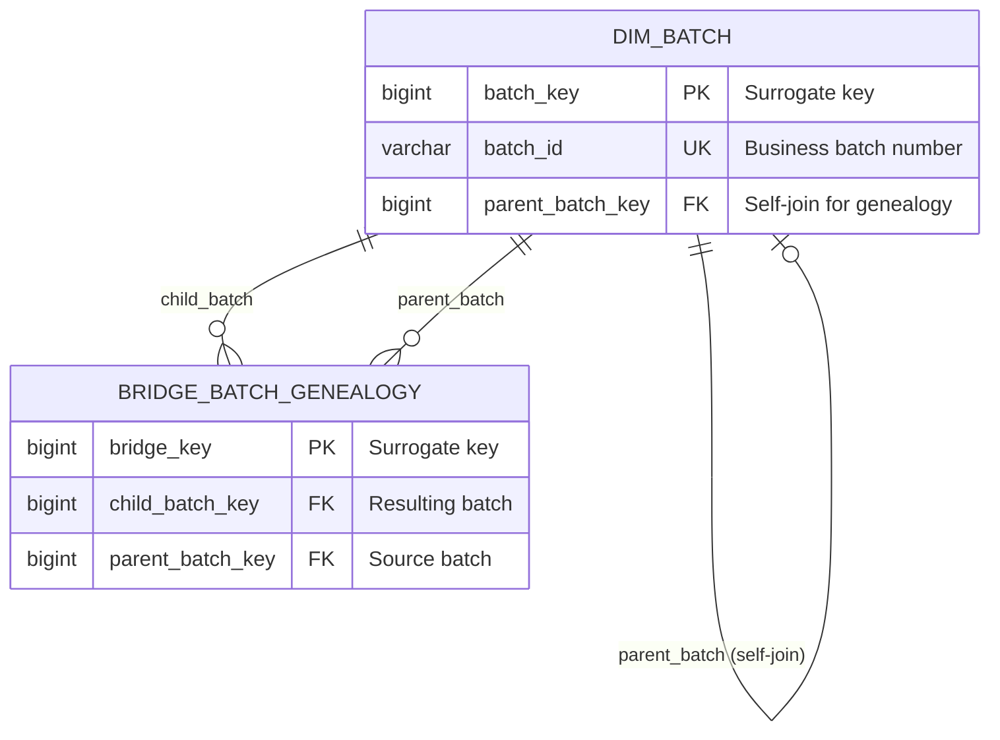
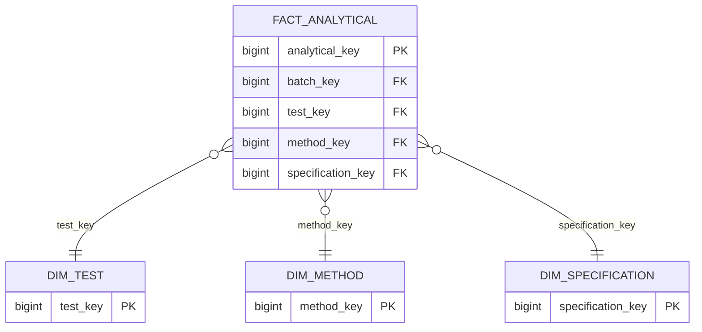
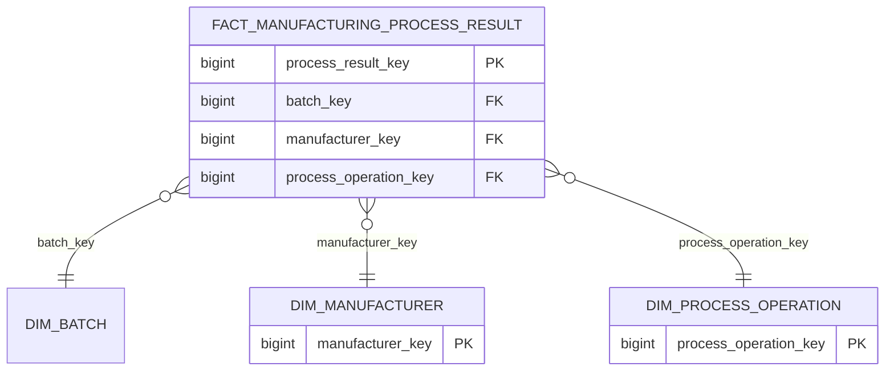
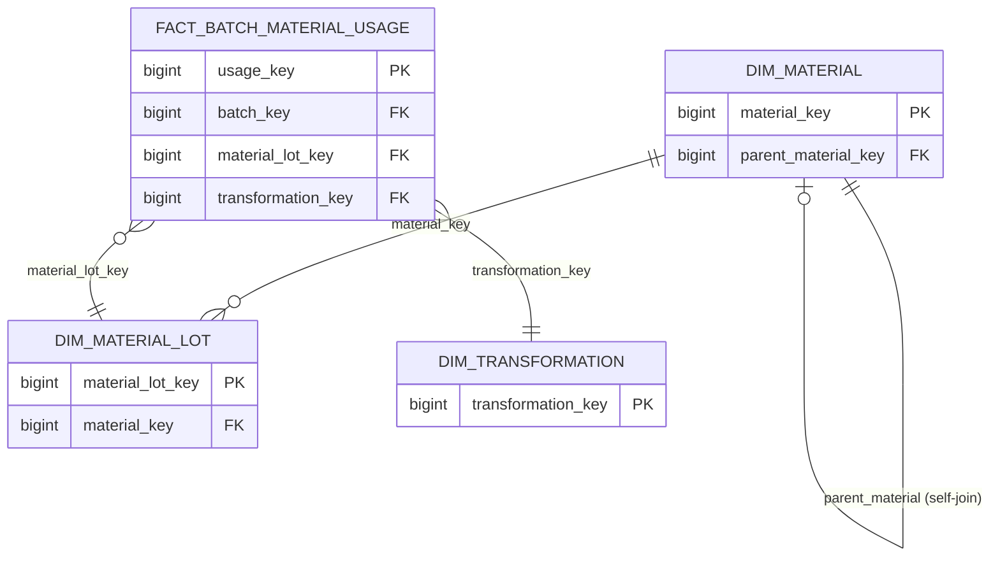

# Before & After: Visual Comparison

This document shows side-by-side comparisons of the refactoring changes.

---

## Example 1: Batch Genealogy Diagram

### BEFORE (Technical Names)


### AFTER (Business-Friendly Names) ✅
```mermaid
erDiagram
    Batch {
        bigint batch identity PK "Surrogate key"
        varchar batch ID UK "Business batch number"
        bigint parent batch identity FK "Self-join for genealogy"
    }
    
    Batch Genealogy {
        bigint bridge identity PK "Surrogate key"
        bigint child batch identity FK "Resulting batch"
        bigint parent batch identity FK "Source batch"
    }
    
    Batch ||--o| Batch : "derived from"
    Batch ||--o{ Batch Genealogy : "produces"
    Batch Genealogy }o--|| Batch : "sourced from"
```

**Key Changes:**
- ✅ `DIM_BATCH` → `Batch`
- ✅ `BRIDGE_BATCH_GENEALOGY` → `Batch Genealogy`
- ✅ `batch_key` → `batch identity`
- ✅ `parent_batch (self-join)` → `derived from`
- ✅ `child_batch` → `produces`

---

## Example 2: Analytical Star Schema

### BEFORE (Technical Names)


### AFTER (Business-Friendly Names) ✅
```mermaid
erDiagram
    Analytical Results {
        bigint analytical identity PK
        bigint batch identity FK
        bigint test identity FK
        bigint method identity FK
        bigint specification identity FK
    }
    
    Test {
        bigint test identity PK
    }
    
    Method {
        bigint method identity PK
    }
    
    Specification {
        bigint specification identity PK
    }
    
    Analytical Results }o--|| Test : "evaluated against"
    Analytical Results }o--|| Method : "tested via"
    Analytical Results }o--|| Specification : "compared to"
```

**Key Changes:**
- ✅ `FACT_ANALYTICAL` → `Analytical Results`
- ✅ `DIM_TEST` → `Test`
- ✅ `DIM_METHOD` → `Method`
- ✅ `DIM_SPECIFICATION` → `Specification`
- ✅ All `_key` → ` identity`
- ✅ `test_key` → `evaluated against`
- ✅ `method_key` → `tested via`
- ✅ `specification_key` → `compared to`

---

## Example 3: Manufacturing Process

### BEFORE (Technical Names)


### AFTER (Business-Friendly Names) ✅
```mermaid
erDiagram
    Manufacturing Process Results {
        bigint process result identity PK
        bigint batch identity FK
        bigint manufacturer identity FK
        bigint process operation identity FK
    }
    
    Manufacturer {
        bigint manufacturer identity PK
    }
    
    Process Operation {
        bigint process operation identity PK
    }
    
    Manufacturing Process Results }o--|| Batch : "performed on"
    Manufacturing Process Results }o--|| Manufacturer : "manufactured by"
    Manufacturing Process Results }o--|| Process Operation : "executes"
```

**Key Changes:**
- ✅ `FACT_MANUFACTURING_PROCESS_RESULT` → `Manufacturing Process Results`
- ✅ `DIM_MANUFACTURER` → `Manufacturer`
- ✅ `DIM_PROCESS_OPERATION` → `Process Operation`
- ✅ All `_key` → ` identity`
- ✅ `batch_key` → `performed on`
- ✅ `manufacturer_key` → `manufactured by`
- ✅ `process_operation_key` → `executes`

---

## Example 4: Material Lineage

### BEFORE (Technical Names)


### AFTER (Business-Friendly Names) ✅
```mermaid
erDiagram
    Material {
        bigint material identity PK
        bigint parent material identity FK
    }
    
    Material Lot {
        bigint material lot identity PK
        bigint material identity FK
    }
    
    Batch Material Usage {
        bigint usage identity PK
        bigint batch identity FK
        bigint material lot identity FK
        bigint transformation identity FK
    }
    
    Transformation {
        bigint transformation identity PK
    }
    
    Material ||--o| Material : "derived from"
    Material ||--o{ Material Lot : "uses"
    Batch Material Usage }o--|| Material Lot : "consumes"
    Batch Material Usage }o--|| Transformation : "transformed by"
```

**Key Changes:**
- ✅ `DIM_MATERIAL` → `Material`
- ✅ `DIM_MATERIAL_LOT` → `Material Lot`
- ✅ `FACT_BATCH_MATERIAL_USAGE` → `Batch Material Usage`
- ✅ `DIM_TRANSFORMATION` → `Transformation`
- ✅ All `_key` → ` identity`
- ✅ `parent_material (self-join)` → `derived from`
- ✅ `material_key` → `uses`
- ✅ `material_lot_key` → `consumes`
- ✅ `transformation_key` → `transformed by`

---

## Example 5: Entity Catalog

### BEFORE (Technical Names)
```html
<table>
    <tr>
        <td><strong>FACT_ANALYTICAL</strong></td>
        <td>FACT</td>
        <td>One row per test result</td>
    </tr>
    <tr>
        <td><strong>DIM_BATCH</strong></td>
        <td>CONFORMED</td>
        <td>One row per batch version</td>
    </tr>
    <tr>
        <td><strong>DIM_MANUFACTURER</strong></td>
        <td>CONFORMED</td>
        <td>One row per manufacturer version</td>
    </tr>
</table>
```

### AFTER (Business-Friendly Names) ✅
```html
<table>
    <tr>
        <td><strong>Analytical Results</strong></td>
        <td>FACT</td>
        <td>One row per test result</td>
    </tr>
    <tr>
        <td><strong>Batch</strong></td>
        <td>CONFORMED</td>
        <td>One row per batch version</td>
    </tr>
    <tr>
        <td><strong>Manufacturer</strong></td>
        <td>CONFORMED</td>
        <td>One row per manufacturer version</td>
    </tr>
</table>
```

**Key Changes:**
- ✅ Catalog entries match diagram entity names
- ✅ Consistent business-friendly naming
- ✅ No technical prefixes

---

## Example 6: Documentation Text

### BEFORE (Technical Language)
```
Data Model Coverage:
- DIM_MANUFACTURER: Multiple CMOs, fill/finish site
- DIM_BATCH: PPQ batches, validation batches
- FACT_MANUFACTURING_PROCESS_RESULT: Validation data
- FACT_TEST_RESULT: Full release testing suite
- DIM_SOURCE_SYSTEM: Integration with MES, LIMS
```

### AFTER (Business-Friendly Language) ✅
```
Data Model Coverage:
- Manufacturer: Multiple CMOs, fill/finish sites
- Batch: PPQ batches, validation batches
- Manufacturing Process Results: Validation data
- Analytical Results: Full release testing suite
- Source System: Integration with MES, LIMS
```

**Key Changes:**
- ✅ Natural business language
- ✅ Consistent with entity names
- ✅ More readable for business stakeholders

---

## Example 7: Self-Join Hierarchies

### BEFORE (Technical Names)
```mermaid
DIM_BATCH ||--o| DIM_BATCH : "parent_batch_key (self-join)"
DIM_MATERIAL ||--o| DIM_MATERIAL : "parent_material_key (self-join)"
DIM_LOCAL_PROCESS_HIERARCHY ||--o| DIM_LOCAL_PROCESS_HIERARCHY : "parent_process_key (self-join)"
```

### AFTER (Business-Friendly Names) ✅
```mermaid
Batch ||--o| Batch : "derived from"
Material ||--o| Material : "derived from"
Local Process Hierarchy ||--o| Local Process Hierarchy : "composed of"
```

**Key Changes:**
- ✅ Clear relationship meaning without technical notes
- ✅ Business users understand "derived from" and "composed of"
- ✅ No need to explain "self-join" in business context

---

## Pattern Summary

### Entity Naming Pattern
```
BEFORE: DIM_<NAME> or FACT_<NAME> or BRIDGE_<NAME>
AFTER:  <Name> (Title Case with spaces)

Examples:
DIM_BATCH → Batch
FACT_ANALYTICAL → Analytical Results
BRIDGE_BATCH_GENEALOGY → Batch Genealogy
```

### Field Naming Pattern
```
BEFORE: <field>_key PK/FK
AFTER:  <field> identity PK/FK

Examples:
batch_key → batch identity
material_lot_key → material lot identity
parent_batch_key → parent batch identity
```

### Relationship Pattern
```
BEFORE: Technical field name
AFTER:  Business action verb

Examples:
batch_key → performed on
manufacturer_key → manufactured by
test_key → evaluated against
parent_batch (self-join) → derived from
```

---

## Consistency Across Artifacts

### ✅ Mermaid Diagrams
- All entity names business-friendly
- All relationships business-meaningful
- All fields use "identity"

### ✅ Entity Catalog
- Entity names match diagram names
- Descriptions use business language
- Consistent terminology

### ✅ Documentation
- All references use business names
- Natural language throughout
- No technical jargon

### ✅ Tooltips & Help
- Business context in all tooltips
- Clear explanations
- Accessible to all stakeholders

---

## Impact Summary

### Before Refactoring
- ❌ Technical entity names (DIM_, FACT_, etc.)
- ❌ Database-centric field names (_key suffixes)
- ❌ Technical relationship labels
- ❌ Mixed terminology in documentation
- ❌ Business users need translation

### After Refactoring
- ✅ Business-friendly entity names
- ✅ Clear field naming (identity)
- ✅ Meaningful relationship labels
- ✅ Consistent terminology everywhere
- ✅ Self-documenting for all stakeholders

---

## Usage Recommendation

**For Business Stakeholders:**
Use the refactored model to:
- Understand data structure without technical knowledge
- Communicate requirements clearly
- Review and validate the model easily

**For Data Engineers:**
Use the refactored model to:
- Communicate with business effectively
- Document the architecture clearly
- Implement with better understanding of business intent

**For BI Developers:**
Use the refactored model to:
- Create user-friendly reports and dashboards
- Name metrics and dimensions clearly
- Align technical implementation with business language

---

*This comparison document demonstrates the comprehensive business-friendly refactoring applied to the Pharma Data Model.*
